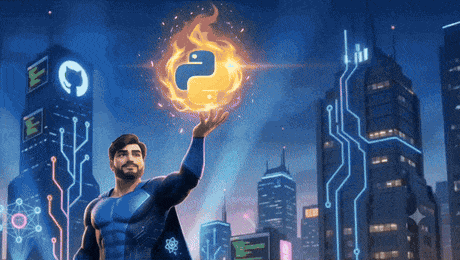

<!-- ================================================================== -->
<!--          GitHub Profile README — Shubhankar Sharma                 -->
<!--          ML Engineer ❖ AI Developer ❖ Agentic AI Builder           -->
<!-- ================================================================== -->

<!-- ══════════════════ HEADER WAVE ══════════════════ -->

 

<!-- ══════════════════ TYPING ANIMATION ══════════════════ -->

  

<!-- ══════════════════ PROFILE METRICS ══════════════════ -->

&nbsp;&nbsp;

&nbsp;&nbsp;

  

<!-- ══════════════════ SOCIAL LINKS ══════════════════ -->
&nbsp;
&nbsp;
&nbsp;
&nbsp;

  

---

## 🧑‍💻 About Me

### Hey there! I'm Shubhankar 👋

A passionate **ML Engineer & AI Developer** pursuing *M.Sc. Mathematics & Computing* at **NIT Hamirpur** (2025–2027). I build end-to-end AI-powered applications — from **multi-agent LLM pipelines** and **RAG systems** to **computer vision models** and full-stack web apps, bridging the gap between pure mathematics and real-world AI solutions.

 

| | |
|:---:|:---|
| 🎓 | **M.Sc. Mathematics & Computing** @ NIT Hamirpur |
| 🤖 | Specializing in **Agentic AI, LLMs, RAG & NLP** |
| 🧠 | Passionate about **Math × Machine Learning** |
| 🌐 | Building **production-grade AI + Full-Stack** apps |
| 🚀 | Seeking **ML Engineer / AI Developer Internships** |
| 📍 | Rajasthan, India |
| 📫 | [shubhankar.s2000@gmail.com](mailto:shubhankar.s2000@gmail.com) |

 

#### 💬 Ask Me About

 

#### ⚡ Fun Fact

I can explain **backpropagation using Linear Algebra** and ship a full-stack AI product in the same week 🧮🚀

 

---

## 🚀 Currently Working On

<table>
<tr>
<td align="center" width="33%">
<h4>🤖 Agentic AI Pipelines</h4>

Multi-agent LangGraph systems with Playwright browser automation &amp; hybrid RAG

</td>
<td align="center" width="33%">
<h4>🖐️ Air Canvas App</h4>

MediaPipe Hands gesture-controlled finger-painting application with real-time CV

</td>
<td align="center" width="33%">
<h4>🏆 ML Internship Hunt</h4>

Actively applying to ML Engineer &amp; AI Developer intern roles across India

</td>
</tr>
<tr>
<td align="center" width="33%">
<h4>🔍 RAG Systems</h4>

ChromaDB &amp; Supabase pgvector retrieval-augmented generation pipelines

</td>
<td align="center" width="33%">
<h4>🌐 AI-Powered Web Apps</h4>

FastAPI backends + React / Next.js frontends with live LLM integration

</td>
<td align="center" width="33%">
<h4>🧮 Math for ML</h4>

Linear Algebra, Probability &amp; Optimization applied to deep learning

</td>
</tr>
</table>

 

---

## 🛠️ Tech Stack & Skills

### 🐍 Languages

 

### 🤖 AI / Machine Learning

  

  

 

### ⚙️ Backend & APIs

 

### 🎨 Frontend

 

### ☁️ Cloud & DevOps

 

### 🗄️ Databases

 

### 🔧 Tools & Platforms

  

 

### 🧮 Mathematics for ML

 

---

## 📌 Featured Projects

<table>
<tr>

<td width="50%" valign="top">
<h3>🤖 Agentic Job Application Pipeline</h3>

End-to-end autonomous pipeline targeting LinkedIn &amp; Naukri. Resume–JD semantic matching, one-click application submission, and anti-detection Playwright browser automation with LangGraph orchestration.

</td>

<td width="50%" valign="top">
<h3>🛡️ Fraud Shield — Real-Time Fraud Detection</h3>

ML-driven fraud detection system with FastAPI backend, high-performance XGBoost + TensorFlow models for real-time risk scoring. Deployed on Hugging Face Spaces &amp; Vercel.

</td>

</tr>
<tr>

<td width="50%" valign="top">
<h3>🎓 RAG-Powered GATE AI Tutor</h3>

Personal AI tutor for GATE DS exam prep. Delivers instant RAG-based explanations for complex math, statistics, and ML concepts using vector similarity search over curated study material.

</td>

<td width="50%" valign="top">
<h3>📹 8-Agent YouTube Automation System</h3>

Fully autonomous 8-agent pipeline: trend research → script generation → neural voiceovers → visual asset fetching → full video assembly — zero human intervention required.

</td>

</tr>
<tr>

<td width="50%" valign="top">
<h3>🌿 Plant Disease Detection (CNN)</h3>

CNN image classifier for plant disease identification from leaf photos using data augmentation and optimized architecture. Multi-class classification deployed as an interactive Streamlit web app.

</td>

<td width="50%" valign="top">
<h3>🏨 TopAvenue — Luxury Hotel Booking</h3>

Premium hotel booking platform featuring a dynamic 4-step booking wizard, real-time admin dashboard, split-panel authentication, and a secure Supabase RLS backend — deployed on Vercel.

</td>

</tr>
</table>

 

---

## 📊 GitHub Analytics

&nbsp;&nbsp;

  

  

  

 

---

  

 

<em>⭐ Crafted with ❤️ by <strong>Shubhankar Sharma</strong> — ML Engineer &amp; AI Developer</em>

  

<a href="https://neuralnexus-iota.vercel.app/">🌐 Portfolio</a> &nbsp;•&nbsp;
<a href="https://linkedin.com/in/shubhankar-sharma-447381370">💼 LinkedIn</a> &nbsp;•&nbsp;
<a href="https://github.com/MLWithMathematics">🐙 GitHub</a> &nbsp;•&nbsp;
<a href="mailto:shubhankar.s2000@gmail.com">📧 Email</a>

